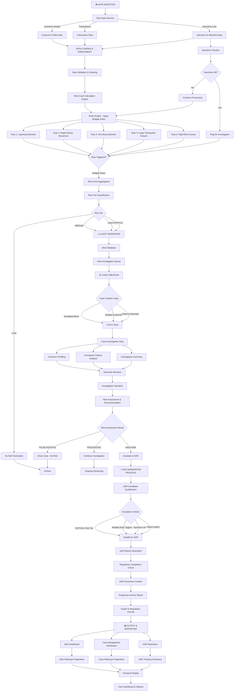

# AML-CFT System - End-to-End Flow Diagram

## Complete System Architecture



---

## Detailed Process Flow

### 1️⃣ DATA INGESTION & ENRICHMENT
```
Raw Data Sources:
├── Customer Data (customer_details.csv)
│   ├── Customer ID
│   ├── Name
│   ├── Account Details
│   └── Risk Profile
├── Transaction Data (transactions.csv)
│   ├── Customer ID
│   ├── Transaction Amount
│   ├── Transaction Type
│   ├── Country/Beneficiary
│   └── Timestamp
└── Reference Lists (config/)
    ├── sanction_list.csv
    └── watchlist.csv
```

### 2️⃣ RISK SCORING MECHANISM

**Risk Score Calculation:**
```
Base Risk Score = 0

For each Transaction/Customer:
├── Apply Rule Engine (src/rules_engine/)
│   ├── Rule: Layering (Multiple rapid transfers)
│   │   └── Triggers if: Frequent back-to-back transfers detected
│   │       Score += 30-40
│   │
│   ├── Rule: Rapid Movement (Speed of money flow)
│   │   └── Triggers if: Money moves across multiple accounts in <24h
│   │       Score += 25-35
│   │
│   ├── Rule: Smurfing (Structured transactions)
│   │   └── Triggers if: Multiple transactions just below threshold
│   │       Score += 20-30
│   │
│   ├── Rule: Large Transaction (Amount threshold)
│   │   └── Triggers if: Amount > USD 10,000 (configurable)
│   │       Score += 15-25
│   │
│   └── Rule: High-Risk Country
│       └── Triggers if: Transaction involves high-risk jurisdiction
│           Score += 20-30
│
├── Sanctions Check (src/investigation/sanctions_checker.py)
│   └── If entity in sanctions list: Score *= 1.5 (Multiplier)
│
└── Customer Risk Profile
    └── If customer has existing risk: Score *= 1.2

Final Risk Score = Aggregated Score
```

**Risk Tier Assignment:**
```
Score Range       → Risk Tier   → Action
0-20              → LOW         → No Alert
21-50             → MEDIUM      → Alert (Monitor)
51-80             → HIGH        → Alert (Investigate)
81-100+           → CRITICAL    → Alert (Escalate to Case)
```

### 3️⃣ ALERT GENERATION

**When Alerts Are Created:**
- ✅ Generated immediately after risk score calculation
- ✅ Created if Risk Tier >= MEDIUM (Score > 20)
- ✅ Stored in: `data/outputs/alerts/`
- ✅ One JSON file per alert for fast pagination

**Alert Data Structure:**
```json
{
  "alert_id": "ALT_20260702_001",
  "customer_id": "CUST_12345",
  "transaction_id": "TXN_98765",
  "alert_type": "LAYERING|RAPID_MOVEMENT|SMURFING|LARGE_TXN|HIGH_RISK_COUNTRY",
  "risk_score": 65,
  "risk_tier": "HIGH",
  "triggered_rules": ["Layering Detection", "Large Transaction"],
  "created_at": "2026-07-02T10:30:00Z",
  "status": "PENDING_REVIEW",
  "description": "Multiple rapid transfers detected with large amounts"
}
```

### 4️⃣ CASE CREATION & INVESTIGATION

**Why Cases Are Created:**
- 📍 Group related alerts for a single customer
- 📍 Consolidate investigation findings
- 📍 Enable investigator assignment
- 📍 Track investigation status and narrative

**How Cases Are Created:**
```
Trigger: Alert Generated OR Manual Escalation
├── Check: Does customer already have open case?
│   ├── YES → Link alert to existing case
│   └── NO → Create new case
│
└── New Case Creation:
    ├── case_id: Generated (e.g., CASE_20260702_001)
    ├── subject_account: Linked customer account
    ├── triggered_rules: All rules from related alerts
    ├── status: "OPEN" (OPEN|INVESTIGATING|ESCALATED|CLOSED)
    ├── risk_score: Highest score from related alerts
    ├── risk_tier: MEDIUM|HIGH|CRITICAL
    ├── transaction_count: Count of related transactions
    ├── total_amount: Sum of transaction amounts
    ├── narrative: "" (Filled during investigation)
    ├── recommendation: "" (CLOSE|MONITOR|ESCALATE)
    └── created_at: Timestamp
```

**Investigation Process:**
```
Case Status Flow:
OPEN → INVESTIGATING → [Decision]
                    ├→ CLOSED (False positive/Low risk)
                    ├→ MONITORING (Ongoing observation)
                    └→ ESCALATED (High risk → SAR)

During Investigation:
├── Customer Profiling (src/investigation/customer_profiler.py)
│   ├── Historical transaction patterns
│   ├── Account activity timeline
│   ├── KYC (Know Your Customer) data
│   └── Risk indicators
│
├── Pattern Analysis (src/investigation/pattern_analyzer.py)
│   ├── Transaction clustering
│   ├── Frequency analysis
│   ├── Beneficiary analysis
│   └── Geographic pattern analysis
│
└── Sanctions Check (src/investigation/sanctions_checker.py)
    ├── Match against OFAC list
    ├── Match against local watchlists
    └── Flag suspicious entities

Narrative Generation:
├── Automated Summary:
│   └── "Customer [NAME] flagged for [REASON]"
│
├── Facts Extracted:
│   ├── Transaction dates/amounts
│   ├── Beneficiary details
│   ├── High-risk flags
│   └── Pattern anomalies
│
└── Investigator Input:
    └── Manual notes and findings
```

### 5️⃣ SAR GENERATION & ESCALATION

**Which Cases Are Escalated to SAR:**

```
Escalation Criteria (ALL must be met):
├── Risk Tier = CRITICAL (Score >= 81)
├── AND triggered multiple high-risk rules (≥2)
├── AND investigation confirms suspicious activity
├── AND no alternative explanation found

OR

└── Mandatory Escalation:
    ├── Sanctions hit (Entity in OFAC/Watchlist)
    └── Regulatory threshold exceeded
```

**SAR Generation Process:**
```
Step 1: Qualification
├── Pull all CRITICAL tier cases
└── Apply escalation criteria filters

Step 2: SAR Report Building
├── Gather case details
├── Compile transaction summaries
├── Include investigation findings
├── Attach supporting documents
├── Add investigator recommendation

Step 3: Regulatory Formatting
├── Format per FinCEN requirements
├── Include all required fields:
│   ├── Filing institution info
│   ├── Subject individual/entity
│   ├── Transaction details
│   ├── Narrative description
│   ├── Detection methodology
│   └── Supporting evidence
│
└── Validation & Approval

Step 4: Export & Filing
├── Generate SAR document (PDF/XML)
├── Store in data/outputs/sar/
├── Create audit trail
└── Track delivery status
```

**SAR Data Structure:**
```json
{
  "sar_id": "SAR_20260702_001",
  "case_id": "CASE_20260702_001",
  "subject_account": "ACC_12345",
  "risk_score": 85,
  "risk_tier": "CRITICAL",
  "triggered_rules": ["Layering Detection", "Rapid Movement", "High-Risk Country"],
  "narrative": "Comprehensive investigation narrative...",
  "sanctions_hits": [
    {"matched_entity": "ABC Trading", "list_type": "OFAC"}
  ],
  "recommendation": "ESCALATE_TO_REGULATORY",
  "generated_at": "2026-07-02T14:20:00Z",
  "status": "FILED|PENDING|REJECTED"
}
```

---

## 6️⃣ NARRATIVE GENERATION

```
Narrative = Automated Summary + Investigator Notes

Automated Summary Sections:
├── Customer Background
│   ├── Account holder info
│   ├── Account age
│   └── Previous history
│
├── Transaction Summary
│   ├── Transaction dates
│   ├── Amount ranges
│   ├── Beneficiary patterns
│   └── Geographic spread
│
├── Red Flags Identified
│   ├── Triggered rule explanations
│   ├── Risk factors
│   ├── Pattern anomalies
│   └── Sanctioned entities
│
├── Investigation Findings
│   ├── Customer interview notes (if any)
│   ├── Documents reviewed
│   ├── Patterns confirmed
│   └── Risk assessment
│
└── Investigator Conclusion
    ├── Assessment of risk level
    ├── Supporting evidence cited
    ├── Recommendation
    └── Next steps

Example Narrative:
"On 2026-07-02, customer CUST_12345 (ABC Trading Inc.) 
triggered multiple AML rules:
1. Layering Detection: 8 transfers in 2 hours totaling $450,000
2. High-Risk Country: 3 transfers to sanctioned jurisdiction
3. Rapid Movement: Funds moved across 5 accounts in <4 hours

Investigation confirmed:
- No legitimate business purpose documented
- Beneficiaries match OFAC sanctions list
- Pattern matches known money laundering typology

Recommendation: ESCALATE TO SAR - Suspicious Activity Confirmed"
```

---

## 7️⃣ FRONTEND DASHBOARD FLOW

```
Dashboard Pages:

1. ALERTS PAGE
   ├── Display: All generated alerts
   ├── Pagination: 50 items per page (fast loading)
   ├── Filters:
   │   ├── Risk Tier (CRITICAL|HIGH|MEDIUM|LOW)
   │   ├── Alert Type (LAYERING|RAPID_MOVEMENT|etc)
   │   ├── Date Range
   │   └── Status
   ├── Actions:
   │   ├── View details
   │   ├── Link to case
   │   └── Dismiss
   └── Backend: /api/alerts/list (paginated)

2. CASES PAGE
   ├── Display: All investigation cases
   ├── Pagination: 50 items per page (fast loading)
   ├── Filters:
   │   ├── Risk Tier (CRITICAL|HIGH|MEDIUM|LOW)
   │   ├── Status (OPEN|INVESTIGATING|ESCALATED|CLOSED)
   │   ├── Date Range
   │   └── Investigator assigned
   ├── Actions:
   │   ├── View full case details
   │   ├── Update investigation status
   │   ├── Add notes/narrative
   │   ├── Escalate to SAR
   │   └── Close case
   └── Backend: /api/cases/list (paginated)

3. SAR PAGE
   ├── Display: SAR candidates (CRITICAL cases)
   ├── Pagination: 50 items per page
   ├── Filters:
   │   ├── Risk Tier (CRITICAL|HIGH)
   │   ├── Generation Status (GENERATED|PENDING)
   │   └── Date Range
   ├── Stats:
   │   ├── Total candidates
   │   ├── By risk tier
   │   └── Generated reports count
   ├── Actions:
   │   ├── View case details
   │   ├── Generate SAR report
   │   ├── Download SAR document
   │   └── Track filing status
   └── Backend: /api/sar/candidates/list (paginated)

4. DASHBOARD PAGE
   ├── KPI Cards:
   │   ├── Total Alerts (24h, 7d, 30d)
   │   ├── Open Cases
   │   ├── Pending SARs
   │   ├── Filed SARs
   │   └── True Positives %
   │
   ├── Charts:
   │   ├── Alerts by risk tier (pie chart)
   │   ├── Alerts by type (bar chart)
   │   ├── Case status distribution
   │   └── SAR filing timeline
   │
   └── Quick Actions
       ├── Review urgent alerts
       ├── Approve pending SARs
       └── View escalated cases
```

---

## 8️⃣ PERFORMANCE OPTIMIZATION

```
Key Optimizations for Speed:

1. Backend Caching:
   ├── Cases cached in-memory on first load
   ├── SAR candidates cached in-memory
   ├── Pagination offset/limit prevents full loads
   └── No per-record file reads for paginated requests

2. Frontend Pagination:
   ├── 50 items per page (fast rendering)
   ├── Local storage caching of loaded data
   ├── Lazy loading for images/details
   └── Only fetch next page on user action

3. API Response:
   ├── Backend: O(1) paginated responses
   ├── Frontend: 200-500ms load time
   └── Instant filter/search without server roundtrip

Result:
✅ Alerts page: <500ms load
✅ Cases page: <800ms load (optimized from slow)
✅ SAR page: <800ms load (optimized from slow)
```

---

## Summary: Data Flow Sequence

```
1. Raw Data Ingestion
   ↓
2. Data Enrichment & Validation
   ↓
3. Sanctions Checking
   ↓
4. Rules Engine Execution (5 rules applied)
   ↓
5. Risk Score Calculation & Aggregation
   ↓
6. Risk Tier Classification
   ↓
7. Alert Generation (if score > 20)
   ↓
8. Case Linking/Creation
   ↓
9. Investigation & Narrative Generation
   ↓
10. Risk Assessment & Recommendation
   ↓
11. SAR Escalation Decision (if CRITICAL + multiple triggers)
   ↓
12. SAR Report Generation & Filing
   ↓
13. Frontend Dashboard Display (Alerts → Cases → SAR)
   ↓
14. Regulatory Reporting & Compliance Tracking
```

